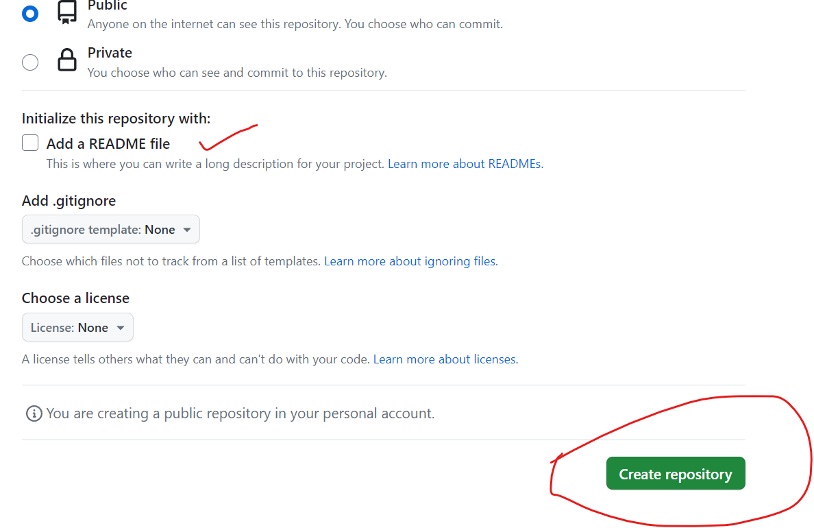
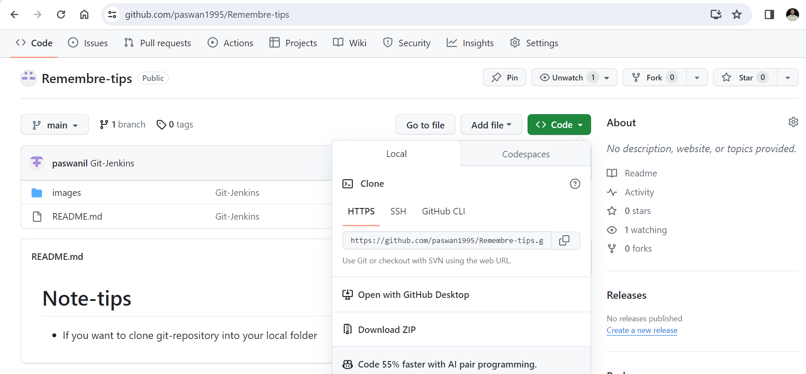

# Remember-tips
* If you want to clone git-repository into your local folder 
* if you dont have github account so plz create, then create 1 new reopsitory
*  
* 
* 
* Now click on the new reop after that click on `code`,`HTTPS----------- copy that link` 
* and now go to terminal and do where you want to do cd=change directory git clone
* `cd d: , cd e: , cd c: ` 
* if you have alredy created repo so there is no need to create a new `folder` in your `local repo`.
* or no need to do `git init` in the `local repository (into your machine)` 
* now just do in that terminal  ---- `git clone` and paste that copy link and paste it.

