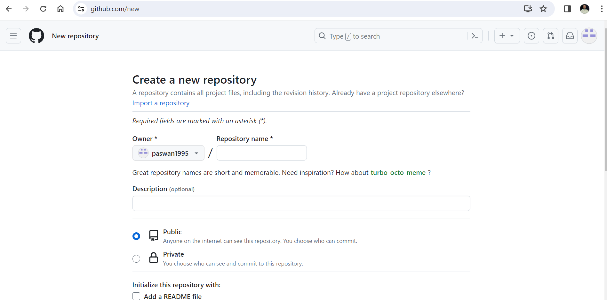

# Remember-tips
* If you want to clone git-repository into your local folder 
* if you dont have github account so plz create, then create 1 new reopsitory
*  
* 
* 
* Now click on the new reop after that click on `code`,`HTTPS----------- copy that link` 
* 
* 
* and now go to terminal and do where you want to do cd=change directory git clone
* `cd d: , cd e: , cd c: ` 
* 
* if you have alredy created repo so there is no need to create a new `folder` in your `local repo`.
* or no need to do `git init` in the `local repository (into your machine)` 
* 
* now just do in that terminal  ---- `git clone` and paste that copy link and paste it.
* 
* 

#### Now if you want to write README.md file follow user discriptoins and to show image in that file you have to create 1 `images` folder in local repo via.. `GUI means mannually in local pc OR mkdir images`= in terminal and save that images/photos in `images folder` .
## Now got to that particular folder where you want to write README.md file or save that files. 
1 do right click now and  click on `open with code or vs code` or in terminal write `code .` it will open `vs code` .

## If you want to view in github accout whatever you write in `vs code` for that you have to do 
1 `git status`
2 `git add .`
3 `git commit -m "some changes"`
4 `git push`

---------------------------------------------------------------------------------------

